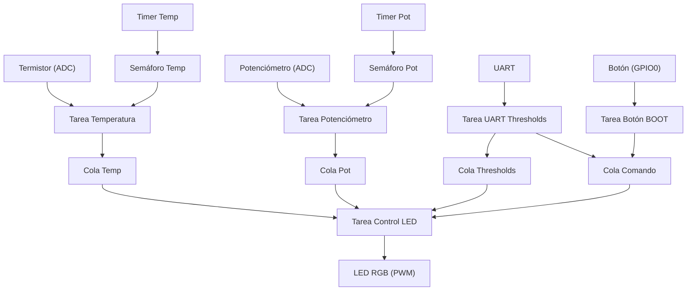

# Informe de Funciones, Colas y Tareas || Cristian David Chalaca Salas
## Proyecto: Control de LED RGB con ESP32 y FreeRTOS

---

## 1. Descripción General

Este proyecto implementa un sistema embebido basado en ESP32 y FreeRTOS para el control de un LED RGB, utilizando sensores analógicos (termistor y potenciómetro) y comunicación UART. El sistema permite la configuración dinámica de umbrales de color, el intervalo de impresión y el encendido/apagado, tanto por comandos UART como por un botón físico. La arquitectura está basada en tareas concurrentes y colas para la comunicación eficiente entre módulos.

---

## 2. Estructura de Software

### 2.1. Principales Archivos y Módulos

- **main.c**: Inicialización de hardware, recursos FreeRTOS y creación de tareas.
- **led_control.c/h**: Lógica de control del LED RGB según temperatura y potenciómetro.
- **sensores.c/h**: Lectura de sensores y envío de datos por colas.
- **uart_thresholds.c/h**: Parser de comandos UART para configuración dinámica.
- **boton_control.c/h**: Lógica del botón físico para ON/OFF.
- **globales.h**: Definiciones globales, pines, colas y estructura de thresholds.

---

## 3. Colas y Variables Globales

Las colas son el mecanismo principal de comunicación entre tareas, permitiendo desacoplar la producción y el consumo de datos.

- **cola_temp** (`QueueHandle_t`):  
  Almacena valores de temperatura leídos por la tarea de sensores.  
  Productor: `tarea_temperatura`  
  Consumidor: `tarea_control_led`, `tarea_uart_thresholds` (consulta)

- **cola_pot** (`QueueHandle_t`):  
  Almacena el valor del potenciómetro (como porcentaje).  
  Productor: `tarea_potenciometro`  
  Consumidor: `tarea_control_led`, `tarea_uart_thresholds` (consulta)

- **cola_thresholds** (`QueueHandle_t`):  
  Almacena los umbrales de temperatura para cada color del LED RGB.  
  Productor: `tarea_uart_thresholds`  
  Consumidor: `tarea_control_led`, `tarea_uart_thresholds` (consulta)

- **cola_comando** (`QueueHandle_t`):  
  Almacena comandos de encendido/apagado (`CMD_ON`, `CMD_OFF`).  
  Productor: `tarea_uart_thresholds`, `tarea_boton_boot`  
  Consumidor: `tarea_control_led`

- **Semáforos y Timers**:  
  - `semaforo_temp`, `semaforo_pot`: Sincronizan la lectura periódica de sensores.
  - `timer_temp`, `timer_pot`: Disparan la lectura periódica de temperatura y potenciómetro.

---

## 4. Tareas FreeRTOS Implementadas

### 4.1. tarea_temperatura

- **Función**: Lee el valor del termistor (temperatura) cada vez que el semáforo es liberado por el timer. Convierte el valor ADC a temperatura y lo envía a `cola_temp`. Imprime periódicamente la temperatura por UART según el intervalo configurado.
- **Productor de**: `cola_temp`
- **Sincronización**: `semaforo_temp` (liberado por `timer_temp_callback`)

### 4.2. tarea_potenciometro

- **Función**: Lee el valor del potenciómetro cada vez que el semáforo es liberado por el timer. Convierte el valor ADC a porcentaje (0-100%) y lo envía a `cola_pot`. Imprime periódicamente el valor por UART.
- **Productor de**: `cola_pot`
- **Sincronización**: `semaforo_pot` (liberado por `timer_pot_callback`)

### 4.3. tarea_control_led

- **Función**: Controla el color y brillo del LED RGB. Lee los valores actuales de temperatura y potenciómetro desde las colas, así como los umbrales de color. Ajusta el PWM de cada canal del LED según la lógica de umbrales y el porcentaje de brillo. Responde a comandos ON/OFF recibidos por la cola `cola_comando`, apagando o encendiendo el sistema.
- **Consumidor de**: `cola_temp`, `cola_pot`, `cola_thresholds`, `cola_comando`

### 4.4. tarea_uart_thresholds

- **Función**: Recibe y procesa comandos por UART para consultar o modificar la configuración del sistema:
  - Consulta de umbrales y voltaje del potenciómetro (`?`)
  - Modificación de umbrales de color (`azul=min,max`, etc.)
  - Modificación del intervalo de impresión (`intervalo=segundos`)
  - Encendido/apagado del sistema (`ON`/`OFF`)
- **Productor de**: `cola_thresholds`, `cola_comando`
- **Consumidor de**: `cola_pot`, `cola_thresholds` (para consulta)

### 4.5. tarea_boton_boot

- **Función**: Monitorea el estado del botón físico conectado a GPIO0. Detecta flancos de bajada (pulsación) y alterna el estado del sistema (ON/OFF), enviando el comando correspondiente por la cola `cola_comando`. Incluye lógica de antirrebote.
- **Productor de**: `cola_comando`

---

## 5. Lógica de Comunicación y Sincronización

- **Lectura de sensores**:  
  Los timers periódicos liberan semáforos, permitiendo que las tareas de sensores lean los valores y los envíen por colas.

- **Control del LED**:  
  La tarea de control del LED espera datos frescos en las colas y ajusta el color/brillo en tiempo real. Si recibe un comando OFF, apaga el LED; si recibe ON, reanuda el control.

- **Configuración dinámica**:  
  Los comandos UART permiten modificar los umbrales de color y el intervalo de impresión en tiempo real, sin reiniciar el sistema. El botón físico ofrece una alternativa rápida para encender/apagar el sistema.

- **Consulta de estado**:  
  El comando `?` por UART permite consultar la configuración actual y el voltaje del potenciómetro, facilitando la supervisión remota.

---

## 6. Ventajas del Diseño

- **Modularidad**: Cada función está separada en tareas independientes, facilitando la extensión y el mantenimiento.
- **Sincronización eficiente**: El uso de semáforos y timers asegura lecturas periódicas y evita bloqueos innecesarios.
- **Comunicación desacoplada**: Las colas permiten que los productores y consumidores trabajen a diferentes ritmos, mejorando la robustez.
- **Configuración en tiempo real**: El sistema puede ser ajustado y supervisado sin detener su funcionamiento.

---

## 7. Diagrama de Interacción (Resumen)

---

## 8. Conclusión

El sistema implementado aprovecha las capacidades multitarea de FreeRTOS y la flexibilidad del ESP32 para ofrecer un control robusto, configurable y eficiente de un LED RGB, integrando sensores y entradas de usuario tanto físicas como remotas. La arquitectura basada en colas y tareas permite una fácil adaptación a futuras ampliaciones, como la integración de más sensores o salidas.

---