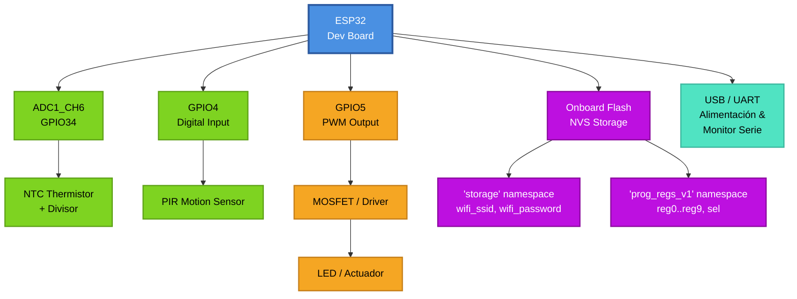
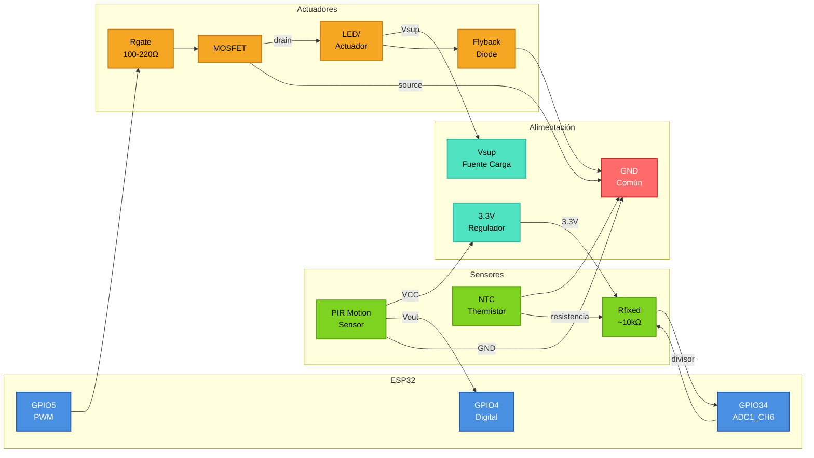

# Proyecto: Controlador ESP32 — Interfaz Web, Sensores y Programación Horaria
# Cristian David Chalaca Salas
## Descripción
Controlador basado en ESP32 que proporciona:
- Interfaz web (AP + STA) para controlar modos: MANUAL, AUTOMÁTICO, PROGRAMADO.
- Lectura de sensores: NTC (temperatura) y PIR (presencia).
- Salida PWM para LED/actuador.
- Persistencia de configuraciones y horarios en NVS.
- Sincronización de hora con SNTP para ejecutar registros programados.

Código principal: `main/wifi_app.c`. Servidor HTTP: `main/http_server.c`. Frontend: `main/webpage/`.

---

## Componentes de Hardware
- ESP32 (placa de desarrollo)
- NTC thermistor (termistor) + resistencia para divisor
- PIR motion sensor (sensor de presencia)
- MOSFET o driver para la carga (motor/actuador) y diodo flyback si la carga es inductiva
- LED indicador (opcional)
- Fuente 3.3V (ESP32) y fuente para la carga si se requiere
- Cables, resistencias, protoboard / PCB

---

## Diagrama de Bloques del Hardware


Referencias de código: pines en `main/globales.h`, PWM API en `main/sensores/pwm_led.h`.

---

## Diagrama de Conexiones (pines)


---

## Diagrama de Bloques del Firmware

```mermaid
graph TD
    FREERTOS["🔷 FreeRTOS<br/>Task Scheduler"]
    
    subgraph TASKS["Tareas Principales"]
        WIFI_TASK["wifi_app_task<br/>Gestión WiFi<br/>HTTP Server<br/>Inicialización"]
        CHECK_STA["check_sta_connection_state<br/>Monitor STA/AP<br/>SNTP Sync"]
        COMPARE_HOUR["task_compare_hour_to_execute_action<br/>Scheduler Programado<br/>Comparación Hora/Día"]
        PWM_TASK["tarea_pwm_led<br/>Manejador PWM<br/>cola_pwm_led"]
        HTTP_HANDLERS["HTTP Server Handlers<br/>Endpoints REST"]
    end
    
    subgraph MODULES["Submódulos de Código"]
        WIFI_MOD["WiFi & SNTP<br/>main/wifi_app.c"]
        WIFI_H["API & Estructuras<br/>main/wifi_app.h"]
        NVS_MOD["NVS Storage<br/>namespaces:<br/>storage<br/>prog_regs_v1"]
        SENSOR_NTC["Sensores<br/>main/sensores/ntc.c<br/>main/sensores/pir_sensor.c"]
        PWM_MOD["PWM Driver<br/>main/sensores/pwm_led.c"]
        HTTP_MOD["HTTP Server<br/>main/http_server.c"]
        FRONT["Frontend Web<br/>main/webpage/<br/>app.js, app.css<br/>index.html"]
    end
    
    subgraph COMMS["Comunicación Inter-Tareas"]
        QUEUE_WIFI["Cola WiFi<br/>wifi_app_queue_handle<br/>3 mensajes"]
        QUEUE_PWM["Cola PWM<br/>cola_pwm_led<br/>pwm_command_t"]
        QUEUE_TEMP["Cola Temperatura<br/>cola_temperatura<br/>float"]
        SEM["Semáforo<br/>mySemaphore<br/>semaforo_temp"]
    end
    
    %% Conexiones FreeRTOS -> Tareas
    FREERTOS --> WIFI_TASK
    FREERTOS --> CHECK_STA
    FREERTOS --> COMPARE_HOUR
    FREERTOS --> PWM_TASK
    FREERTOS --> HTTP_HANDLERS
    
    %% Tareas -> Módulos
    WIFI_TASK --> WIFI_MOD
    WIFI_TASK --> NVS_MOD
    WIFI_TASK --> QUEUE_WIFI
    
    CHECK_STA --> WIFI_MOD
    CHECK_STA --> QUEUE_WIFI
    
    COMPARE_HOUR --> QUEUE_PWM
    COMPARE_HOUR --> NVS_MOD
    
    PWM_TASK --> PWM_MOD
    PWM_TASK --> QUEUE_PWM
    
    HTTP_HANDLERS --> HTTP_MOD
    HTTP_HANDLERS --> NVS_MOD
    HTTP_HANDLERS --> QUEUE_PWM
    
    %% Sensores
    SENSOR_NTC --> QUEUE_TEMP
    SENSOR_NTC --> QUEUE_PWM
    
    %% Frontend
    HTTP_MOD --> FRONT
    
    %% Headers compartidos
    WIFI_TASK --> WIFI_H
    HTTP_HANDLERS --> WIFI_H
    COMPARE_HOUR --> WIFI_H
    
    style FREERTOS fill:#4a90e2,stroke:#2c5aa0,color:#fff,stroke-width:3px
    style WIFI_TASK fill:#7ed321,stroke:#5fa319,color:#000,stroke-width:2px
    style CHECK_STA fill:#7ed321,stroke:#5fa319,color:#000,stroke-width:2px
    style COMPARE_HOUR fill:#7ed321,stroke:#5fa319,color:#000,stroke-width:2px
    style PWM_TASK fill:#7ed321,stroke:#5fa319,color:#000,stroke-width:2px
    style HTTP_HANDLERS fill:#7ed321,stroke:#5fa319,color:#000,stroke-width:2px
    
    style WIFI_MOD fill:#f5a623,stroke:#c67f1a,color:#000,stroke-width:2px
    style WIFI_H fill:#f5a623,stroke:#c67f1a,color:#000,stroke-width:2px
    style NVS_MOD fill:#bd10e0,stroke:#8d0aa0,color:#fff,stroke-width:2px
    style SENSOR_NTC fill:#f5a623,stroke:#c67f1a,color:#000,stroke-width:2px
    style PWM_MOD fill:#f5a623,stroke:#c67f1a,color:#000,stroke-width:2px
    style HTTP_MOD fill:#f5a623,stroke:#c67f1a,color:#000,stroke-width:2px
    style FRONT fill:#50e3c2,stroke:#3cb89f,color:#000,stroke-width:2px
    
    style QUEUE_WIFI fill:#ff6b6b,stroke:#c92a2a,color:#fff,stroke-width:2px
    style QUEUE_PWM fill:#ff6b6b,stroke:#c92a2a,color:#fff,stroke-width:2px
    style QUEUE_TEMP fill:#ff6b6b,stroke:#c92a2a,color:#fff,stroke-width:2px
    style SEM fill:#ff6b6b,stroke:#c92a2a,color:#fff,stroke-width:2px
```



---

## Descripción de las Tareas creadas
- `wifi_app_task` (`main/wifi_app.c`)  
  - Inicializa TCP/IP, WiFi AP/STA, SoftAP config, arranca servidor HTTP, crea cola y semáforo, lanza tareas auxiliares.

- `check_sta_connection_state` (`main/wifi_app.c`)  
  - Bucle periódico (20 s): revisa conexión STA, intenta reconectar usando credenciales NVS y llama `obtain_time()` para SNTP al conectarse.

- `task_compare_hour_to_execute_action` (`main/wifi_app.c`)  
  - Espera sincronización de tiempo; cada 30 s recorre `s_program_regs[]` y compara hora/día. Si coincide, ejecuta `toogle_led()` (acción programada).

- `tarea_temperatura` (`main/sensores/ntc.c`)  
  - Lee ADC periódicamente (timer), calcula temperatura, publica en `cola_temperatura` y decide duty según `current_mode` (MANUAL/AUTOMÁTICO/PROGRAMADO). Envía `pwm_command_t` a `cola_pwm_led`.

- `tarea_pwm_led` (`main/sensores/pwm_led.c`)  
  - Consume `cola_pwm_led` y aplica duty (0..8191) al hardware PWM.

- HTTP server handlers (`main/http_server.c`)  
  - Endpoints: GET `/program_registers.json`, POST `/program_register.json`, POST `/select_register.json`, endpoints de sensores y control.

---

## Persistencia (NVS)
- Namespaces & claves:
  - `"storage"`: `wifi_ssid`, `wifi_password`, y legacy `reg01`..`reg10`.
  - `"prog_regs_v1"`: `reg0`..`reg9` (blobs `program_register_t`), `sel` (registro seleccionado).
- Funciones clave: `save_program_register()`, `load_program_register()`, `initialize_registers()`, `save_wifi_credentials()`, `load_wifi_credentials()`.

---

## Build & Flash (rápido)
Asumiendo entorno ESP-IDF configurado:
```bash
cd /home/davidpc/Sistemas_en_tiempo_Real-2025/http_sever_and_flash_program
idf.py set-target esp32
idf.py build
idf.py -p /dev/ttyUSB0 flash monitor

```

## Archivos clave
- main/wifi_app.c — lógica WiFi, scheduling, NVS
- main/wifi_app.h — API y estructuras
- main/http_server.c — endpoints REST
- main/globales.h — pines y variables globales
- main/sensores/ntc.c — lectura NTC / lógica temperatura
- main/sensores/pwm_led.c — driver PWM
- main/webpage/ — frontend (app.js, app.css,index.html)